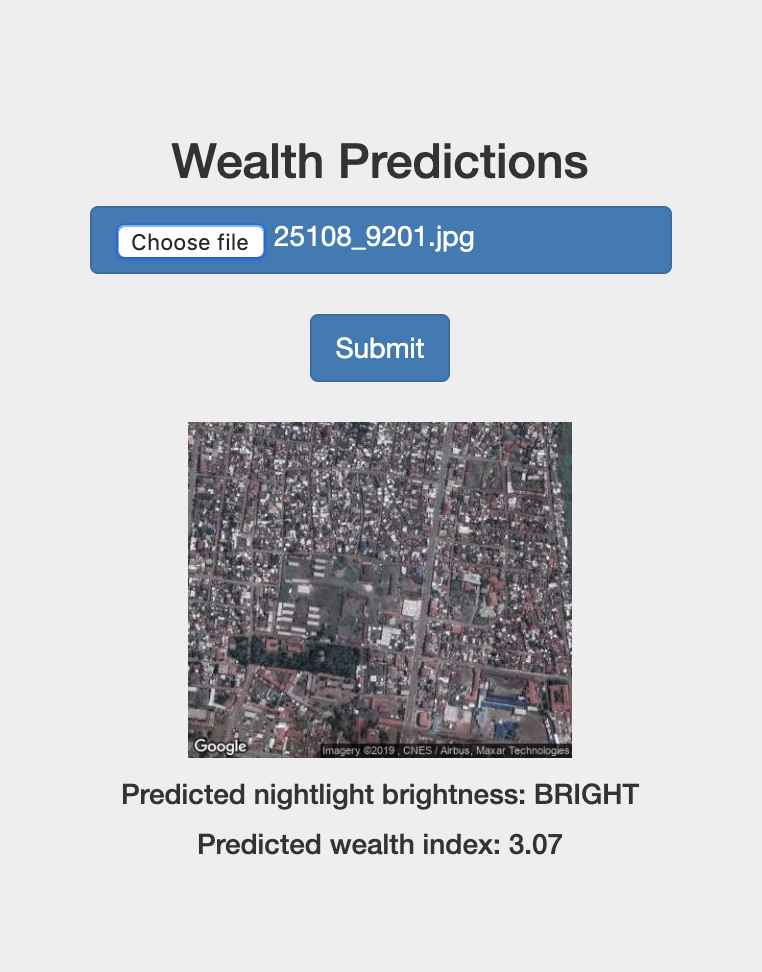

# poverty-classifier
This is a web app for classifying poverty levels from daytime satellite images (wealth indicies), as well as predicting corresponding nighttime luminosity intensities (dim, medium, or bright). It uses a Keras model, deployed as a REST API with the Flask web framework. The model was trained on thousands of 1-km-by-1-km images, obtained using the Google Static Maps API. The hdf5 object file with weights of the trained CNN model is linked [here](https://drive.google.com/drive/folders/1BAJDuZ4kadwS76rjv7it2n0CzULiwZpE?usp=sharing).

Sample images are provided for exploring. The app is hosted online here: <https://poverty-classifier.azurewebsites.net/>

## Run locally
* Clone the repository.
* `pip install -r requirements.txt`
## Run
* `python app.py`
* Open up a browser and go to `localhost:5000`.
* Upload and submit a daytime satellite image.

  

